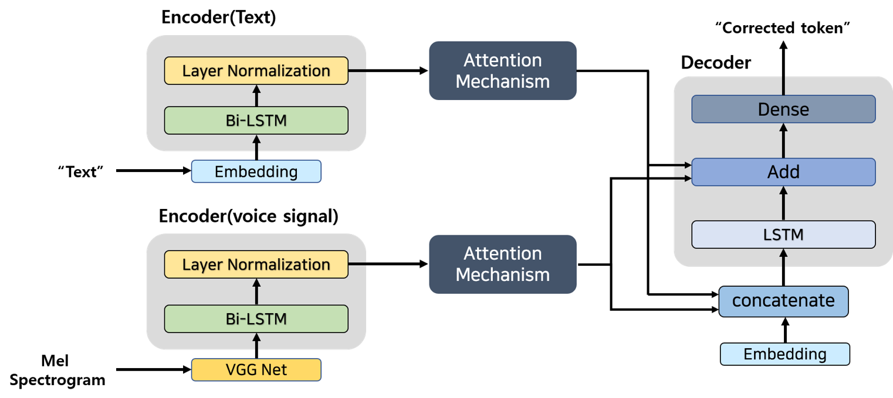

# Multimodal_Post-Editing

Conference : HCLT 2020 (Korea)

## Research background

1. Automatic Speech Recognition(ASR) model are highly affected quality of the voice signal.
   - Almost system correct the ASR model's output text through pre-trained language model or text correction model. 
2. Language model and text correction model can't consider voice signal
   - The characteristic of the text-based correction model are dependent on ASR models output text.

## Related research

1. [Attention mechanism based Chinese text correction model](https://ieeexplore.ieee.org/document/9037666) 

- The Chinese Text correction model.
- In that research, the attention-based text correction model's performance is better than LSTM  encoder-decoder

2. [Multimodal(Audio signal + Video Signal) based ASR model](https://www.isca-speech.org/archive/Interspeech_2017/abstracts/1296.html)

 

- This model receives multi-source input (audio feature, video feature)
- That model utilize Visual Adaptive Training Model(VAT) to align audio and video features.

## proposed model

- VGG Net
  - The VGG Net used in vision tasks. But, much of researches are used VGG Net for extract audio features. 
  - In this study, we used VGG Net to extract audio features from Mel spectrogram 
- Bidirectional LSTM
  - LSTM is one of Recurrent Neural Network. Therefore, LSTM is very suitable to process the sequence type input.
  - The bidirectional LSTM analysis the input sentences through forward pass and backward pass. As a result, the bidirectional LSTM can extract sentence's forward meaning and backward meaning. 
  -  In this study, bidirectional LSTM is used for extracting the voice signal feature and text feature.
- Attention Mechanism (Bahdanau's Attention)
  - LSTM can't perfectly solve the long-term  dependency problems. Attention Mechanism help solving that problem.
  - Another advantage of attention mechanism is that can help to deliver gradient like skip connection or residual connection. 

- Decoder
  - Decoder generate post-edited token through context vector (Attention mechanism's output feature)

## Dataset

- [Clova Call dataset](https://github.com/clovaai/ClovaCall)
- ASR model : [Google cloud speech to text](https://cloud.google.com/speech-to-text?hl=ko&utm_source=google&utm_medium=cpc&utm_campaign=japac-KR-all-ko-dr-bkws-all-super-trial-e-dr-1009137&utm_content=text-ad-none-none-DEV_c-CRE_263225556651-ADGP_Hybrid%20%7C%20AW%20SEM%20%7C%20BKWS%20~%20T1%20%7C%20EXA%20%7C%20ML%20%7C%201%3A1%20%7C%20KR%20%7C%20ko%20%7C%20Speech%20%7C%20speech%20to%20text%20google%20%7C%20en-KWID_43700031880239721-kwd-94457331132&userloc_1009843-network_g&utm_term=KW_speech%20to%20text%20google&gclid=Cj0KCQjwuL_8BRCXARIsAGiC51A3ShDYZCmEkx-aQOShSNCUqnnn5cDIPOwQQkSsnGZMyXLUy4H-U9AaAqUsEALw_wcB) (STT)
  - The input text was made by STT model. 

## Experiments Result

|                  | model                        | wer (%)   |
| ---------------- | ---------------------------- | --------- |
| STT              | STT                          | 15.9 %    |
| Text based model | RNN Encoder-Decoder          | 36.17 %   |
| Text based model | Transformer                  | 21.76 %   |
| Text based model | Attention based model        | 8.05%     |
| Multimodal model | RNN Encoder-Decoder + VAT    | 18.75%    |
| Multimodal model | Multimodal based Transformer | 20.08%    |
| Multimodal model | **Proposed Model**           | **7.77%** |

